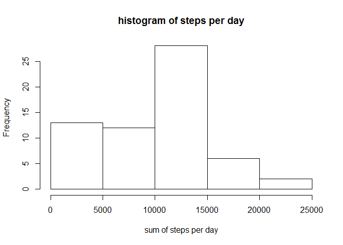
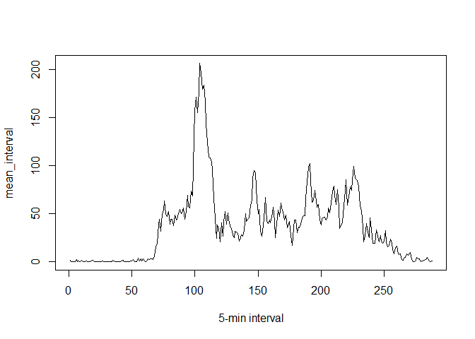

# Reproducible Research: Peer Assessment 1


## Loading and preprocessing the data


```r
echo = TRUE

setwd("C:/Users/mka582/Documents/R_Work/Course5-Week2/Source_Data")

activity<-tempfile()

download.file("https://d396qusza40orc.cloudfront.net/repdata%2Fdata%2Factivity.zip",activity,method = "auto",mode="wb")

unzip(activity,"activity.csv")

activity <- read.csv("activity.csv", header = T, sep = ",")
```


## What is mean total number of steps taken per day?


```r
echo = TRUE
sumdata <- tapply(activity$steps, activity$date, sum, na.rm=T)

echo = TRUE
hist(sumdata, xlab = "sum of steps per day", main = "histogram of steps per day")
```

<!-- -->

```r
echo = TRUE
mean_data <- round(mean(sumdata))
median_data <- round(median(sumdata))

print(c("The mean is",mean_data))
```

```
## [1] "The mean is" "9354"
```

```r
print(c("The median is",median_data))
```

```
## [1] "The median is" "10395"
```

## What is the average daily activity pattern?


```r
echo = TRUE
mean_interval <- tapply(activity$steps, activity$interval, mean, na.rm=T)
plot(mean_interval, type="l", xlab = "5-min interval")
```

<!-- -->

```r
echo = TRUE
mean_interval[which.max(mean_interval)]
```

```
##      835 
## 206.1698
```

## Imputing missing values

###  No of missing value

```r
echo = TRUE
table(is.na(activity) == TRUE)
```

```
## 
## FALSE  TRUE 
## 50400  2304
```

###  Fill in missing value with the calculated mean

```r
echo = TRUE
activitynona <- activity  # creation of the dataset that will have no more NAs
for (i in 1:nrow(activity)){
    if(is.na(activity$steps[i])){
        activitynona$steps[i]<- mean_interval[[as.character(activity[i, "interval"])]]
    }
}
```

###  Histogram of total no. of steps taken per day

```r
echo = TRUE
sumdata2 <- tapply(activitynona$steps, activitynona$date, sum, na.rm=T)
hist(sumdata2, xlab = "sum of steps per day", main = "histogram of steps per day")
```

<!-- -->

###  Mean and Median of no na data

```r
mean_data2 <- round(mean(sumdata2))
median_data2 <- round(median(sumdata2))

echo = TRUE
print(c("The mean is",mean_data2))
```

```
## [1] "The mean is" "10766"
```

```r
print(c("The median is",median_data2))
```

```
## [1] "The median is" "10766"
```


## Are there differences in activity patterns between weekdays and weekends?

###  New column added for "WeekDays" and "WeekEnd" days

```r
echo = TRUE
activitynona$weekday <- c("weekday")
activitynona[weekdays(as.Date(activitynona[, 2])) %in% c("Saturday", "Sunday", "samedi", "dimanche", "saturday", "sunday", "Samedi", "Dimanche"), ][4] <- c("weekend")
table(activitynona$weekday == "weekend")
```

```
## 
## FALSE  TRUE 
## 12960  4608
```

```r
activitynona$weekday <- factor(activitynona$weekday)
```

###  Mean calculation for "WeekDays" and "WeekEnd"


```r
echo = TRUE
activity2_weekend <- subset(activitynona, activitynona$weekday == "weekend")
activity2_weekday <- subset(activitynona, activitynona$weekday == "weekday")

mean_activity2_weekday <- tapply(activity2_weekday$steps, activity2_weekday$interval, mean)
mean_activity2_weekend <- tapply(activity2_weekend$steps, activity2_weekend$interval, mean)

echo=TRUE

library(lattice)

df_weekday <- data.frame(interval = unique(activity2_weekday$interval), avg = as.numeric(mean_activity2_weekday), day = rep("weekday", length(mean_activity2_weekday)))
df_weekend <- data.frame(interval = unique(activity2_weekend$interval), avg = as.numeric(mean_activity2_weekend), day = rep("weekend", length(mean_activity2_weekend)))
df_final <- rbind(df_weekday, df_weekend)

xyplot(avg ~ interval | day, data = df_final, layout = c(1, 2), 
       type = "l", ylab = "Number of steps")
```

<!-- -->
